  

  

  
  
  
  

---

### About Me

Software engineer who builds products end to end. Mobile is where I go deepest, but I follow the problem wherever it lives — API design, data modelling, web, and release engineering included.

- **Product engineering** — I take features from an empty repo to something on a real device: architecture, state management, offline-first data, auth, CI/CD and store releases
- **Mobile depth** — native Android with Kotlin and Jetpack Compose, cross-platform with Flutter
- **Beyond the client** — TypeScript and JavaScript on the web, Java on the JVM, REST APIs and backends with Firebase and Supabase
- **How I work** — clean architecture, meaningful tests, and readable code matter more to me than any single framework; the stack below is a set of tools, not an identity
- **Right now** — building AI-assisted product experiences: voice capture, receipt scanning, and smart automation

---

### Tech Stack

  

---

### GitHub Stats

  
  

  

---

### Featured Projects

  
  
  
  

---

### Contribution Activity

  

  <picture>
    <source media="(prefers-color-scheme: dark)" srcset="https://raw.githubusercontent.com/7pak/7pak/output/snake-dark.svg" />
    <source media="(prefers-color-scheme: light)" srcset="https://raw.githubusercontent.com/7pak/7pak/output/snake.svg" />
    
  </picture>

  

<!--
  The stats, language and project cards in assets/ are generated by
  scripts/generate-cards.mjs and refreshed every 12h by .github/workflows/cards.yml.
  They are rendered in this repo on purpose — no third-party card service to go down.
-->
